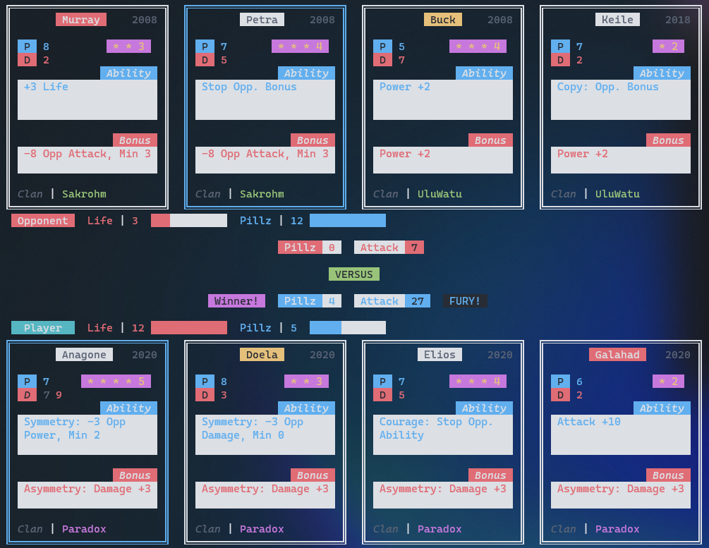

# UrbanRecreation - Rust

This is a port of the game Urban Rivals written in Rust, based on another implementation built in TypeScript, <a href="https://github.com/ArmaanAS/UrbanRecreation">UrbanRecreation</a>. 

This does _not_ include a compiler which transforms ability strings to data. This relies on pre-compiled abilities and cards data from the TypeScript version.

## Basic Usage

Define 2 hands of 4 cards, either from their names or card ids:

```Rust
let h1 = Hand::from_names("Anagone", "Doela", "Elios", "Galahad");
let h2 = Hand::from_names("Murray", "Petra", "Buck", "Keile");
```

Create the game struct:

```Rust
let mut game = Game::new(h1, h2);
```

Select the index of the card you want to play (0, 1, 2, 3), the number of pillz (0..=12) and if you want fury (true | false):

```Rust
// Player selects the 1st card with 4 pillz and fury.
game.select(0, 4, true);
// Opponent selects the 2nd card with no pillz or fury.
game.select(1, 0, false);
```

The game will print out to the console, the cards, player info and round info.



### Command Line Args

You can specify the names of the cards you want to play, first 4 names are your cards, next 4 names are the opponents card.

`cargo run -- Anagone Doela Elios Galahad Murray Petra Buck Keile`

If you want the Opponent to play first, pass any argument after the names:

`cargo run -- Anagone Doela Elios Galahad Murray Petra Buck Keile 1`

### Console input

When you start the game with cards specified in command line args, the console will wait for your input. Valid input formats:

> _`"0"`_  

Play card 0 (1st card on the left) with 0 pillz and no fury

> _`"1 4"`_  

Play 2nd card with 4 pillz and no fury

> _`"3 9 true"`_  

Play 4th card with 9 pillz and fury!

## Architecture

A game of Urban Rivals consists of 2 players battling with 4 cards each. The first player picks a card and some pillz and then the second player does the same. The cards will then battle. This is a single round. There can be upto 4 rounds.

In a round, once both players pick their card and pillz, the battle logic starts. All of the following data structures are used in the battle logic:

- `Game` - Contains all information related to a game of Urban Rivals. Cards, Players, ability Events.
- `Card` - Data related to a card, abilities, card stats, clan, is protected, is stopped, e.t.c.
- `Ability` - This contains data related to each ability. Ability / Bonus / Global type, Modifiers, Conditions.
- `Modifier` - This contains logic related to an ability which will apply an ability to the Cards / Players / Game. E.g. `-4 Life` results in:
  - `BasicModifier { change: 4, opp: true, stat: Life, won: true, ... }`
  - `opp: true` - Apply logic on Opponent
- `Condition` - This contains logic which effects the Modifiers to either stop them from applying if the condition is not met or even changes the logic of a Modifier, e.g. `Support:` condition will set the multiplier for `BasicModifier` to 4 if all cards in the hand are the same clan.
- `Events` - This stores a list of abilities of cards being played and global abilities like leader abilities. Each ability has an associated `event_time` which defines when in a round is the ability triggered. E.g. `-4 Life` has `event_time: EventTime::End` which will apply the ability's modifiers after the round has ended. E.g. `Copy Opp. Ability` is run at the start.
- `Player` - Contains life, pillz, Player / Opponent, did they win the round.

## License

<a href="https://rem.mit-license.org/">MIT License</a>